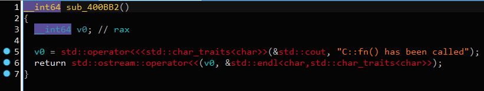
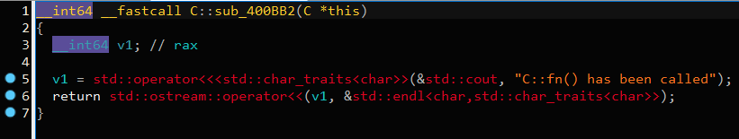
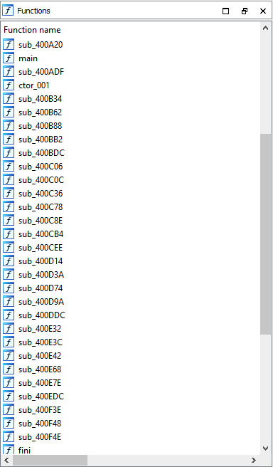
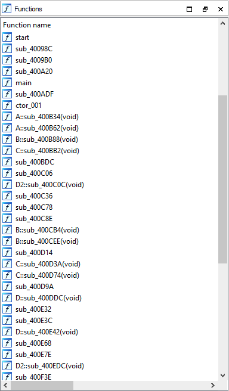
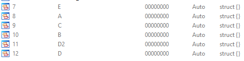

### RTTI parser
---

Parses RTTI information from executable.

---

This repository and author are open to feature requests. You're more than welcome to open a feature request in issue tab. For template see [FEATURE REQUEST](./FEATURE_REQUEST.md)

---

### Example

**HexRays decompiler view**

Before:

After:

**Functions window**

Before:

After:

**Structs window**

### Install & Run

1. git clone https://github.com/MlsDmitry/better-rtti-parser
2. Click on "IDA > File > Script file" and choose rtti_parse.py
3. Happy RE time!

### Why another RTTI parser ?

Known tools didn't have functionality to rename functions based on typeinfo ( e.g. sub_4B5A to BaseClass::AnotherClass::sub_4B5A ). So, I decided to spend few more hours to rewrite code, learn how to write IDA plugins. Finally, it works pretty fast, I really liked it, so I'll continue to update it.

### Known issues

#### Can't rename byte at 'xxx' because the name is already used in the program.

**Problem**:

It's a bug that will be fixed in later commits. Probably, will add number prefix to names as IDA does for functions.

**Steps to resolve**

Click on ignore for this database and continue. 

### Current cover 

- [x] GNU g++ 64-bit 
- [x] IDA Pro 7.4-7.6
- [x] Rename functions to BaseClass::AnotherClass::sub_4B5A format
- [x] Create structures for vtables
- [x] Fix: some functions are only renamed, but retyping fails
- [x] Fix: place "v" at the end of symbol only if there are no parameters for function
- [x] Beta support for ARM 32-bit
- [ ] Find destructors ( Not really sure how accurate it will be )
- [ ] Make class graph
- [ ] IDA Pro 7.0-7.3 support
- [ ] GNU G++ 32-bit
- [ ] MSVC 64-bit
- [ ] MSVC 32-bit

### Test environment

- Windows 10 2021 H1
- IDA Pro 7.6
- Python 3.10 ( I'm surprised this python version works well )
- x64 GNU g++ binary

### Examples

Check out example folder. There are .elf files for you to test.

Example output ->

### Credits

1. [@IgorSkochinsky](https://twitter.com/igorskochinsky) for http://www.hexblog.com/wp-content/uploads/2012/06/Recon-2012-Skochinsky-Compiler-Internals.pdf ( plugin algo entirely based on his research )
2. [@layle_ctf](https://twitter.com/layle_ctf) made my life easier with IDA remote script execution and debugging https://github.com/ioncodes/idacode
