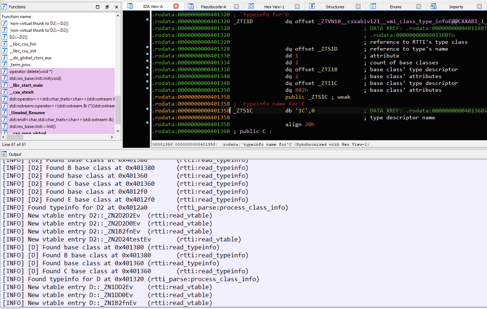

### RTTI parser
---

Parses RTTI information from executable.

### Why another RTTI parser ?
I didn't really liked code in SusanRTTI repo and it didn't do what I want ( rename functions to BaseClass::AnotherClass::sub_4B5A ). I decided to spend few more hours to rewrite code, learn how to write IDA plugins. Finally, it became a lot faster, I really liked it, so I'll continue to update it.

### Install & Run
1. git clone https://github.com/MlsDmitry/better-rtti-parser
2. Click on "IDA > File > Script file" and choose rtti_parse.py
3. Happy RE time!

### Known issues
#### No Code refs found for _ZNTV...
**Problem**: I didn't find a way to get address of first character of string that matched at some position. If know/found solution just add answer in [#1](https://github.com/MlsDmitry/better-rtti-parser/issues/1#issue-1092129391) issue

**Steps to resolve**:
Find full symbol name for __class_type_info, __si_class_type_info or __vmi_class_type_info by searching in IDA and replace old ones in TiClassKind in rtti_parse.py.

### Current cover 
- [x] GNU g++ 64-bit 
- [x] IDA Pro 7.4-7.6
- [ ] Rename functions to BaseClass::AnotherClass::sub_4B5A format
- [ ] Make class graph ( Not really sure if needed )
- [ ] Create structures for vtables
- [ ] IDA Pro 7.0-7.3
- [ ] GNU G++ 32-bit
- [ ] MSVC 64-bit
- [ ] MSVC 32-bit

### Test environment
- Windows 10 2021 H1
- IDA Pro 7.6
- Python 3.10 ( I'm surprised this python version works well )
- x64 GNU g++ binary

### Example
Check out example folder. There is .idb and .elf files for you to test.
Example output ->

### Credits
1. [@IgorSkochinsky](https://twitter.com/igorskochinsky) for http://www.hexblog.com/wp-content/uploads/2012/06/Recon-2012-Skochinsky-Compiler-Internals.pdf ( plugin algo entirely based on his research )
2. [@layle_ctf](https://twitter.com/layle_ctf) made my life easier with IDA remote script execution and debugging https://github.com/ioncodes/idacode